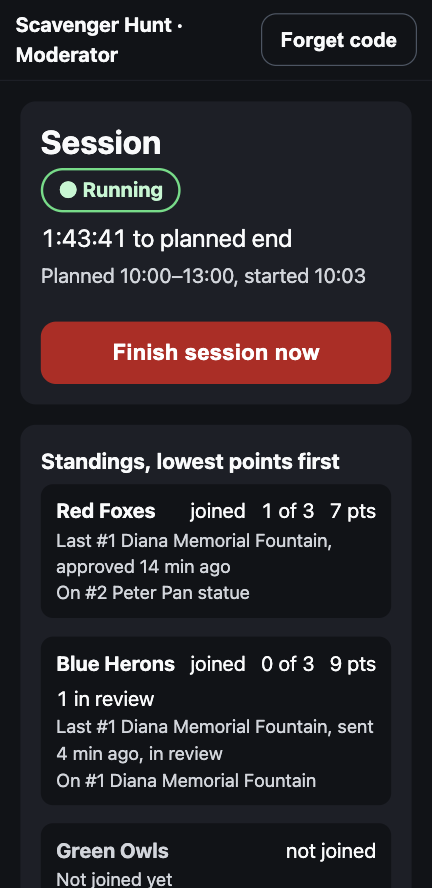
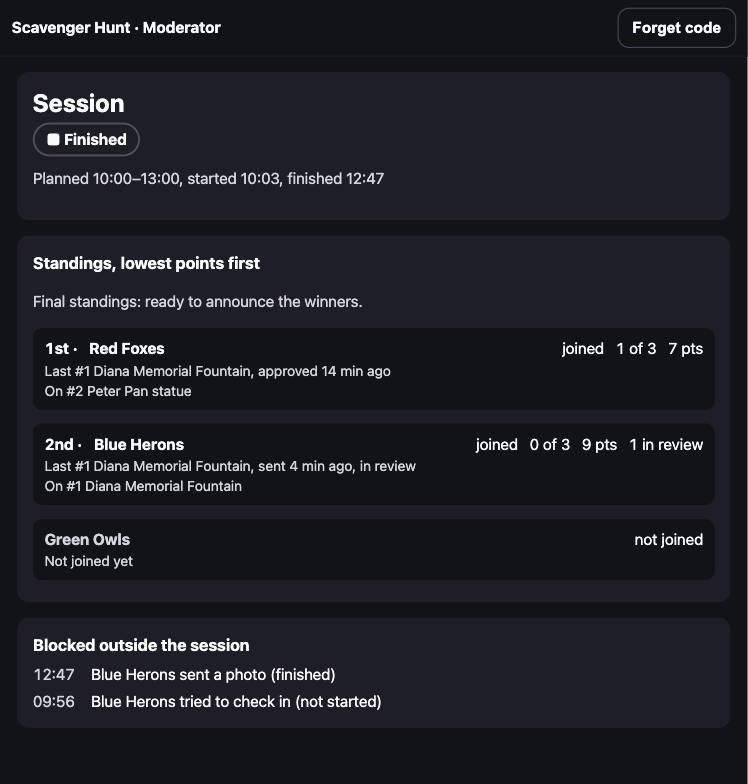
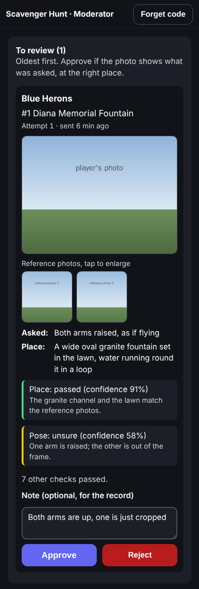

# Moderator guide

You start and finish the game, follow the teams, and announce the winners.
The planned times are only a guide: nothing starts or ends until you do it.



1. **Open the moderator link** on a phone or a laptop:
   `/moderator?session=<session id>`. Enter the **moderator code**. It's kept
   only in that browser tab and forgotten when the tab closes, so keep the
   tab open during the game. **Forget code** signs you out.
2. **Start the session** when the teams are ready, early or late. Confirm,
   and teams can check in and send photos from then on. Until you start,
   their phones show the lobby.
3. **Follow the standings**, lowest points first. Each team shows whether
   it has joined, checkpoints completed, points, photos in review, the
   checkpoint it's on, and its last completed checkpoint with how long ago
   it was approved. A team that hasn't moved for a while may be stuck: step
   in with a hint or encouragement, by phone or in person.
4. **Review the photos** the referee couldn't decide. They wait in **To
   review**, at the top of the screen: see *Reviewing photos* below.
5. **Watch *Blocked outside the session***. It lists players who tried to
   join, check in or send a photo before the start or after the finish.
6. **Finish the session** with **Finish session now**. When every team has
   completed its route, a banner says *All teams have finished*. Once the
   planned end has passed, the badge says *Running, past planned end* as a
   reminder. Confirm: teams can't check in or send photos after this, and it
   **can't be undone**. If photos are still in review, the confirmation says
   how many: you can still decide them after the finish.
7. **Announce the winners** from the final standings, which now show each
   team's place. Lowest points win. While photos are still in review, the
   standings say *Waiting for n reviews* instead: decide them first.



The screen refreshes every 5 seconds while it's open. It shows checkpoint
numbers and names, never clues or locations.

## Reviewing photos



The referee (an AI model) checks each photo for the place and the pose.
When it isn't sure, the photo waits for you in **To review (n)**, oldest
first, and the team scores nothing for that checkpoint until you decide.
For each photo you see:

- the team, the checkpoint, the attempt, and how long ago it was sent;
- the team's photo, and the checkpoint's **reference photos**: tap any of
  them to see it larger;
- **Asked:** the pose the team was given, and **Place:** what the
  checkpoint looks like;
- what the referee said about the place and the pose, how confident it was,
  and why. If it didn't answer (for example, it ran out of time), the screen
  says so: judge from the photo.

**Approve** if the photo shows the pose at the right place; otherwise
**Reject**. A note is optional: it's kept for the record, and the team
never sees it. There's no confirmation, because you can change your mind:
the photo moves to **Recently decided**, where **Change** shows it again
with **Approve** and **Reject**.

An approved photo takes the team's place at that checkpoint by **when it
was sent**, not when you approved it. Teams aren't told which photo you
ruled on: their points update on their phones within a few seconds.

The photos are shown only on this screen, with your code, and the browser
doesn't keep them.

### Overriding the referee

The screen shows only the photos the referee wasn't sure about. To overturn
a photo it **passed** or **failed**, ask the game-server directly. You'll
need its address from the organiser. Type the code at the prompt, so it
doesn't end up in your shell history:

```sh
GAME_SERVER=https://<game-server address>
read -rs -p 'Moderator code: ' CODE; echo
# Find the photo's "submission" number: newest photos first, with the team,
# checkpoint, verdict and the referee's reasons.
curl -H "Authorization: Bearer $CODE" "$GAME_SERVER/sessions/<session id>/traces?limit=20"
# Then approve or reject it (the note is optional).
curl -X POST -H "Authorization: Bearer $CODE" -H 'content-type: application/json' \
  -d '{"ruling": "reject", "note": "Wrong fountain"}' \
  "$GAME_SERVER/sessions/<session id>/submissions/<submission>/ruling"
```

The ruling then shows under **Recently decided**, where **Change** works as
for any other.
