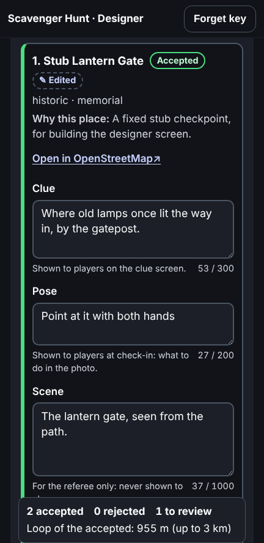
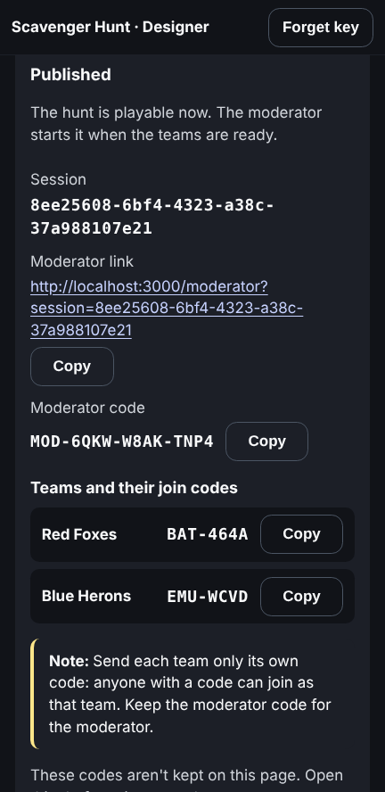

# Organiser guide

You design the hunt before any session exists. You give an area and a theme,
and the **hunt designer**, an AI agent on the game-server, picks real places
from map data, orders them into a walking loop, and writes a clue and a pose
for each. It takes a few minutes. Then you review its work, checkpoint by
checkpoint, and publish the hunt for teams to join.

## Starting a design

1. **Open the designer** on a laptop or a phone: `/designer`. Enter the
   **organiser key** (the game-server's `GAME_SERVER_ORGANISER_KEY`). It's
   kept only in that browser tab and forgotten when the tab closes. **Forget
   key** signs you out.
2. **Fill in *New design***:
   - **Area**: a place the map can find, such as "Chiswick, London". A large
     area is cut down to a walkable size around its centre.
   - **Theme**: what the hunt is about, such as "The Thames and brewing
     history".
   - **Checkpoints**: 3 to 8. The default is 3.
   - **Longest walk (km)**: 0.5 to 10, for the whole loop. The default is 3.
     Teams start at different checkpoints and each walks the loop minus one
     leg, so no team walks further than this.

   Area and theme need 3 to 200 characters each. The page tells you what to
   fix before anything is sent.
3. **Start design**. The draft opens at the top of the page, and you can
   follow it there. It runs on the game-server, so you can close the page
   and come back: **Drafts, newest first** lists every design with its
   status, area, theme, when it started and, once it's finished, what it
   cost. Tap one to open it.

Only one design runs at a time. If one is already running, the page says
*A design is already running*, with **Follow it** to open it. If it says
*The hunt designer isn't switched on on the game-server*, ask whoever runs
the game-server to turn it on.

By default a design stops after 5 minutes and spends at most $1; the
game-server's settings can change both.

## Following a design

While it runs, the draft shows *Designing…*, how long it has been running,
and each step as it happens, with how far into the run it came:

| Step | What the designer is doing |
|------|----------------------------|
| Finding the area | Looking up your area on the map, e.g. "Chiswick, London, England". "(clipped)" means it was cut down to a walkable size; "No area matches" means the map couldn't find it |
| Looking for places | Listing the named, public places in the area, such as memorials, artworks, fountains and parks, e.g. "58 candidate places" |
| Reading about a place | Reading one place's details, such as its inscription or history, to write a clue |
| Measuring the route | Measuring the walk between some places, e.g. "A loop of 3 places, 1410 m" |
| Checking the draft | Checking a draft against the rules: "No problems" when it passes; otherwise the problems, which it then fixes |
| Writing clues and challenges | Only on a test game-server, whose stand-in designer shows four fixed steps and is ready within seconds |

A step can say what went wrong instead, such as "The map data timed out".
That doesn't end the run: the designer tries something else. A step this
page doesn't know is shown by its own name.

The page checks the draft every 2 seconds while it's open and running, and
stops once it's ready or has failed.

## When a design fails

The draft says *Failed* and why:

| The page says | What happened | What to try |
|---------------|---------------|-------------|
| The designer ran out of steps. | It used all its turns without a hunt that meets the rules | Try again, perhaps with fewer checkpoints or a longer walk |
| It reached its spending limit. | It spent its budget without a hunt that meets the rules | As above |
| It took too long. | It was cut off at its time limit, usually because the map data was slow | Try again later |
| It couldn't produce a hunt that meets the rules. | It gave up, often because the area has too few suitable places for the theme | A broader theme, or a fuller area name |
| The designer couldn't start. | The AI service didn't start or failed | Try again later. The game-server's log says why |
| The server restarted during the run. | The game-server shut down or restarted | Start the design again |

Under *Problems from its last attempt* are the rules its last draft broke,
which show what it was stuck on. For example: "Checkpoint 2: Checkpoints 2
and 3 are 90 m apart; keep them at least 150 m apart". The rules are:

- checkpoints at least 150 m apart, and the loop no longer than your walk;
- a clue or pose mustn't give away the place's name;
- a clue fits on a phone screen (up to 300 characters).

**Try again** fills in *New design* with the same request. Change anything
you like, then **Start design**.

## Reviewing a draft

The designer's work is for you to approve. A ready draft shows, at the top,
the area it found, the loop's length, and how long the run took, its turns
and what it cost. Below that is one card per checkpoint, in walking order.

**Reading the map**: above the cards, the dashed box is the area, each
checkpoint is a numbered marker in walking order, and the line is the loop,
straight from place to place as the designer measures it. Use it to judge
the choices: are the places spread out, is the loop walkable, does one sit
across a main road? A marker is yellow to review and green once accepted; a
rejected one is faded and left out of the loop. Tap a marker to go to its
card, or a checkpoint's name to find it on the map. If the map can't load,
the page says so, and the cards still work. Once the hunt is published, the
map shows only its checkpoints, numbered as they are in the hunt.

Each card has:

- **The place**: its name and kind, and *Why this place*, the designer's
  reason for choosing it. **Open in OpenStreetMap** shows it on the map, in
  a new tab.
- **Clue**: shown to players on the clue screen. Up to 300 characters.
- **Pose**: shown to players at check-in, saying what to do in the photo.
  Up to 200 characters.
- **Scene**: what the photo's background should show, for the referee only.
  Players never see it. Up to 1000 characters.
- **Check-in radius**: how close, in metres, a team must be to check in.
  20 to 100.

A counter under each text shows its length against its limit.

To review a checkpoint:

1. **Read it**, and open it on the map if you're not sure of the place.
2. **Fix what's wrong**: change the text or the radius, then **Save
   changes**. Only what you changed is sent. While it saves, the card's
   buttons are disabled. The game-server checks your text against the same
   rules as the designer's. If it refuses, the reason shows under the field
   it's about, and nothing is saved. For example, *"Checkpoint 1's clue
   gives the place away ("lantern"); describe it without its name"*: a clue
   or pose mustn't contain the place's name, or a distinctive word from it.
   Once you've saved a change, the card is marked **✎ Edited**.
3. **Accept** or **Reject** it. **Undo** puts it back to *To review*.

Only the accepted checkpoints go into the hunt. The bar at the bottom of the
screen counts how many are accepted, rejected and still to review. It also
shows the loop's length over the accepted checkpoints only, against the
longest walk you asked for. Leaving checkpoints out makes the loop shorter.

## Publishing

Publishing turns the accepted checkpoints into a session on the game-server,
which teams can join at once.

**Publish hunt** is enabled once no checkpoint is still to review, at least
3 are accepted, and every change is saved. Until then, the page says what's
missing.

Fill in:

- **Hunt name**: up to 100 characters, shown to the teams.
- **Planned start** and **Planned end**, in your own time. They're for the
  teams' countdown: the moderator still starts and finishes the session.
- **Teams**: 1 to 10, each with its own name of up to 40 characters. Names
  must differ by more than capital letters. **Add a team** adds a row, and
  **Remove** takes one away.

Then **Publish hunt**. The page asks you to confirm, because publishing
makes the hunt playable at once, and you can't edit it afterwards.

If the game-server refuses, the page says why: for example, the draft was
changed or published in another tab since you opened it. The page then
reads the draft again.

Once it's published, the page shows:

- the **session** id;
- the **moderator link** (`/moderator?session=…`) and the **moderator
  code**, for whoever runs the session;
- each team's **join code**.

Each has a **Copy** button.

**Send each team only its own code.** Anyone with a code can join as that
team. Give the moderator link and code only to the moderator.

The codes are fetched from the game-server each time you open the published
draft, and never kept in the browser. To see them again later, open the
draft from *Drafts, newest first*.

The places come from [OpenStreetMap](https://www.openstreetmap.org/). Map
data © OpenStreetMap contributors.

## Keeping the answers secret

A draft's clues, places, poses and scenes are the answers to the hunt, and
the join and moderator codes let anyone into it. The page shows them only to
you, with your key. The browser doesn't keep them, and the page's address
holds only the draft's id. The map shows where every checkpoint is: don't
show the screen to players.

If the page says *That organiser key isn't right*, the key was mistyped or
has changed on the game-server: enter it again. *No connection to the game
server* means the game-server can't be reached. The page keeps trying.
