# How to play

Your team follows clues around the park. At each checkpoint you check in,
take a photo with a pose, and the game checks it. The lowest points win.

## 1. What you need

- A phone with **Safari** (iPhone) or **Chrome** (Android), charged, with
  mobile data.
- Your **team code**, from the organiser (for example `FOX-7Q2K`).

## 2. Join your team

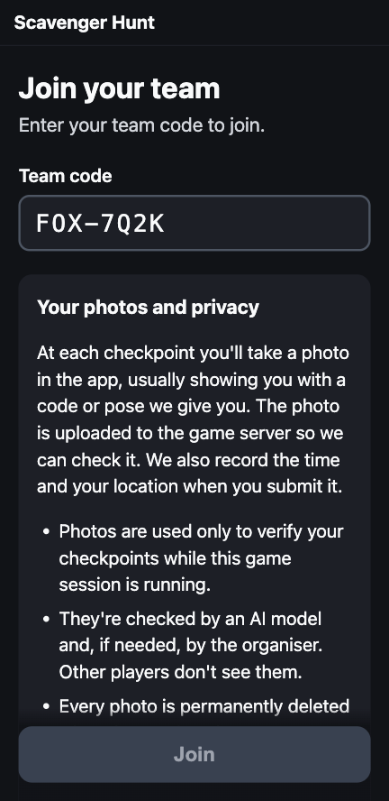

1. Open the game link the organiser sent you.
2. Type your team code. Capitals are added for you.
3. Read **Your photos and privacy**. The full notice is behind
   [Read the full privacy notice](privacy-notice.md).
4. Tick the box to agree, then tap **Join**.

Joining again with the same code, even on another phone, puts you back in
the same team.

If the code isn't recognised, check it with the organiser. If the screen
says *This session is over*, the game has already finished.

## 3. Allow camera and location

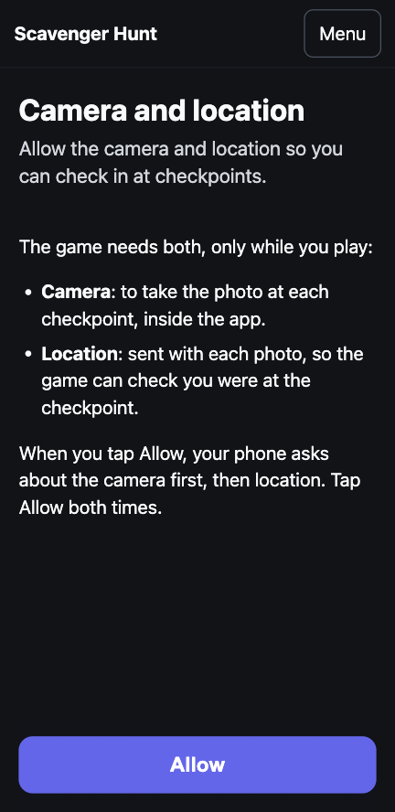

The game needs both, and only while you play:

- **Camera**, to take the photo at each checkpoint inside the app. You can't
  upload a photo from your gallery.
- **Location**, sent with each photo, so the game can check you were at the
  checkpoint.

Tap **Allow**. Your phone asks about the camera first, then location. Tap
**Allow** both times.

**If you tapped "Don't Allow" by mistake:**

- **iPhone (Safari):** tap **aA** in the address bar, then **Website
  Settings**, and set **Camera** and **Location** to **Allow**. If location
  still fails: **Settings › Privacy & Security › Location Services › Safari
  Websites › While Using the App**.
- **Android (Chrome):** tap the icon left of the web address, then
  **Permissions**, and turn on **Camera** and **Location**. If location still
  fails, check that Location is on in the phone's quick settings.

Then tap **Try again** in the game.

## 4. Before the start

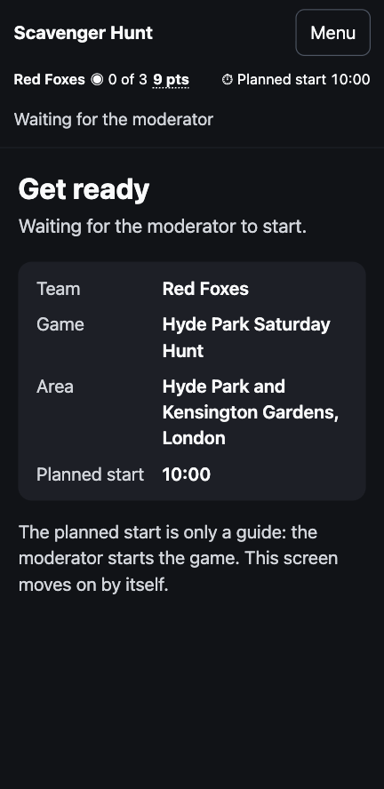

After joining you wait in the lobby. It shows your team, the game, the area
and the planned start. The planned times are only a guide: **the moderator
starts the game**, and the screen moves on by itself when they do. You can
lock your phone; the game picks up where it was when you come back.

## 5. The status bar

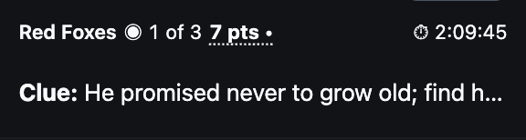

From the lobby on, the top of the screen shows:

- **Your team**.
- **◉ 1 of 3**: checkpoints completed. Photos still in review count.
- **Points**: your points if the game finished now. **Lowest wins.** At each
  checkpoint your team scores its place there: 1 if your photo was accepted
  first, 2 if second, and so on. A checkpoint you haven't done counts N+1,
  where N is the number of teams playing. A **•** after the points means a
  photo is **in review**: a moderator will look at it, and once it's accepted
  your points go down. Tap the points to read this on your phone.
- **⏱ Time left** until the planned end. It turns amber under 15 minutes and
  red under 5, and says how many minutes are left. Past the planned end it
  says *Finishing soon*: the game ends only when the moderator finishes it.
- **Clue:** the clue you're working on. Tap it to read it all.

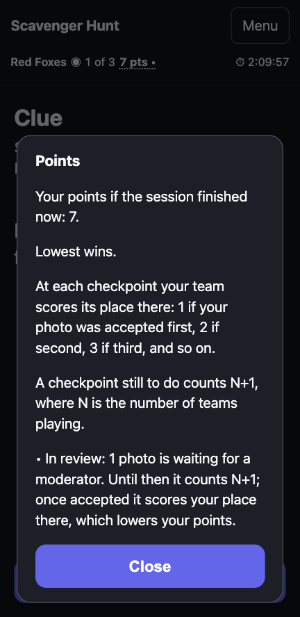

## 6. Playing a checkpoint

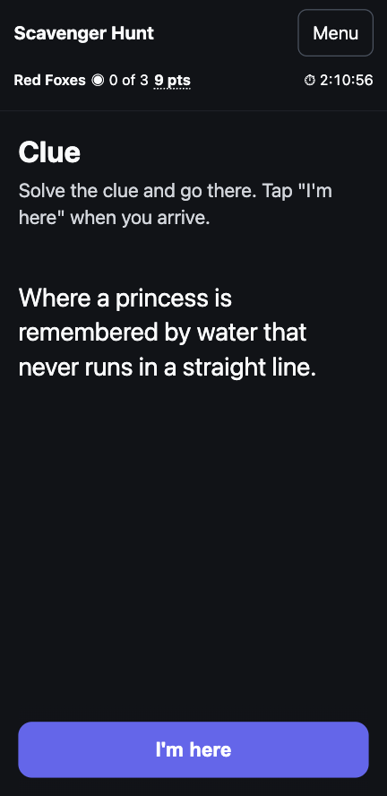

1. **Read the clue** and work out where to go. If the button says the
   checkpoint isn't open yet, check back soon.
2. When you're there, tap **I'm here**.

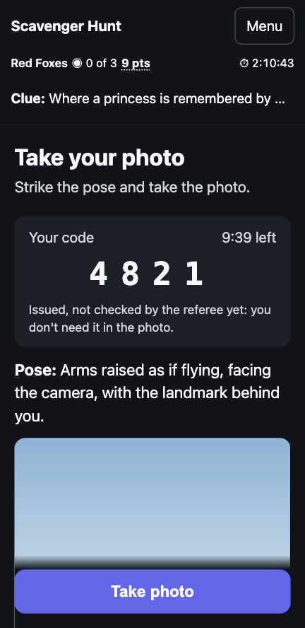

3. You get a **code** and a **pose**. Today the code isn't checked: you
   don't need it in the photo. If the code runs out, the game quietly gets
   you a new one.
4. Strike the pose, with the landmark behind you, and tap **Take photo**.
   **⇄ Front / back** switches to the selfie camera.

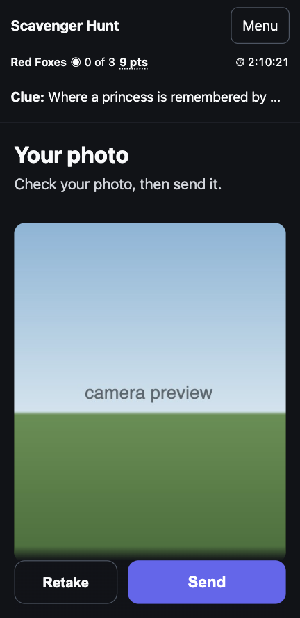

5. Check the photo. **Retake** if it isn't right, otherwise tap **Send**.
6. The referee checks it, usually in under 10 seconds.
7. Read the result:
   - **✓ Checkpoint done**: tap **Next clue**.
   - **? In review**: a moderator will look at it. Tap **Next clue** and
     carry on.
   - **✗ Not quite**: see below.

## 7. When a photo isn't accepted

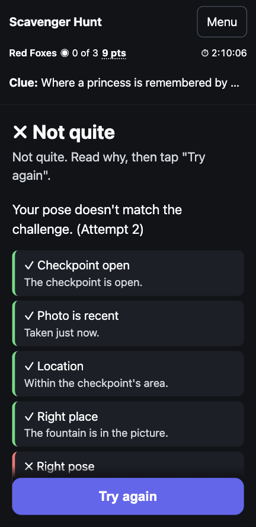

The result lists each check, with ✓ for passed and ✗ for failed:

| Check | What it means | What to do |
| --- | --- | --- |
| Checked in | You tapped **I'm here** at this checkpoint, and the check-in hadn't run out | **Try again** checks you in afresh |
| Checkpoint open | The checkpoint was open when you sent the photo | Wait until it opens |
| Photo is recent | The photo was taken just now | Take a fresh one |
| Photo time | The photo's time looks right | Check your phone's clock is set automatically |
| Location | You were in the checkpoint's area | Move closer to the landmark, out in the open |
| New photo | The photo hasn't been sent before | Take a new photo |
| Right place | The landmark is in the photo | Get the landmark clearly behind you |
| Right pose | Your pose matches the challenge | Read the pose again and try it |

Tap **Try again**. You get a **new code** and go back to the camera.

## 8. After the end

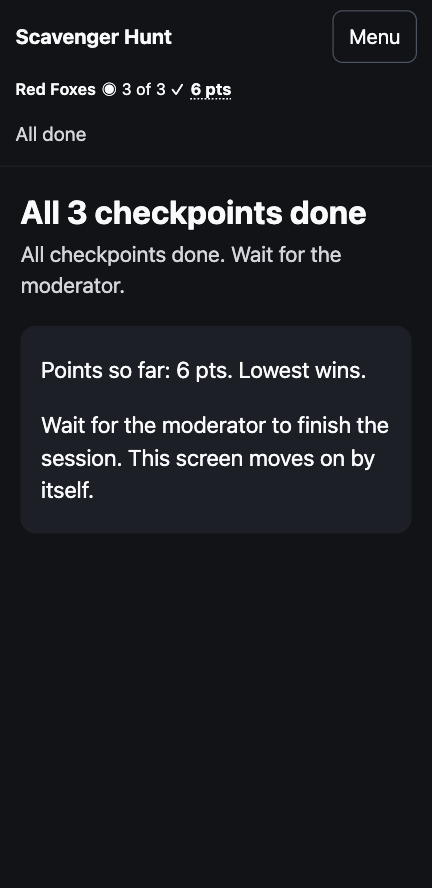

When your team has done every checkpoint, the screen says so with your
points. Wait for the moderator to finish the game.

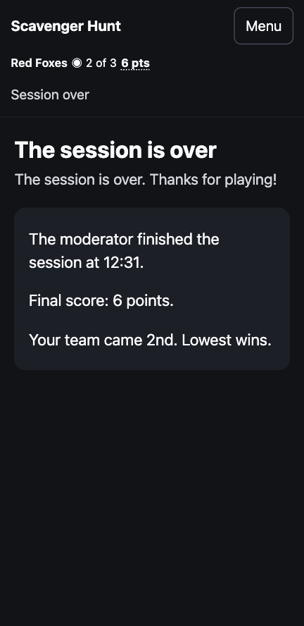

When the moderator finishes the game, every phone shows **The session is
over**, with your final points and your team's place. After that you can't
check in or send photos. A photo sent after the end, or before the start, is
recorded but doesn't count.

## 9. Problems

- **No signal.** A banner says *No connection*. Move somewhere with better
  signal and tap **Retry**. A photo you were about to send is kept: tap
  **Send** again.
- **A black camera.** Wait a moment and tap **Take photo** again. If it stays
  black, close other apps that use the camera, then reload the page.
- **An imprecise location** (*Your location fix is imprecise*). Move into the
  open, away from tall buildings and trees, and retake.
- **"You may be outside the checkpoint area."** Only a hint: you can still
  send the photo. Moving closer gives you a better chance.
- **"Your check-in ran out. Tap Send to try again."** The check-in ran out
  while your photo was sending, or another phone in your team sent a photo
  first. The game has checked you in again and kept your photo: tap
  **Send**.
- **You reloaded the page.** You're still in your team. If you were taking a
  photo, tap **I'm here** again for a new code.
- **You switched phones.** Join with the same team code on the new phone.
- **Leave this game**, in the menu, signs this phone out of your team. You
  need the team code to come back.

## 10. Your photos

- Photos are used only to check your checkpoints while this game is running.
- They're checked by an AI model and, if needed, by the organiser. Other
  players don't see them.
- Every photo is permanently deleted when the session closes.
- They're never used for anything else: no sharing, no marketing, no training
  AI models and no face recognition.

Read the [full privacy notice](privacy-notice.md).
